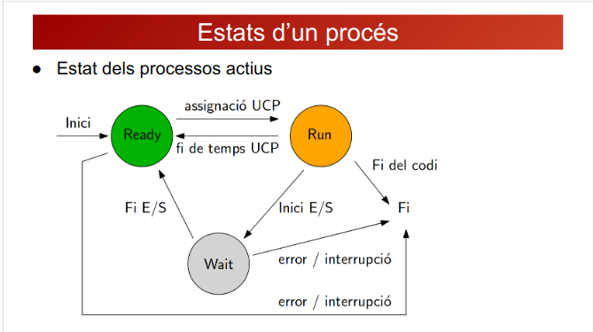

## Estats del Procés

1. **Estat del Procés:**

 - **RUN:** El procés està sent executat per la CPU, duent a terme les instruccions del seu programa.
 - **READY:** El procés està preparat per a executar-se, esperant el seu torn per a ser seleccionat per la CPU.
 - **WAIT:** En situacions com a operacions d'entrada/sortida, un procés pot estar en espera, bloquejat fins que es completi l'esdeveniment esperat.

IMATGE

### Transició d'Estats dels Processos

La vida d'un procés es caracteritza per la seva transició entre diversos estats, cada un amb una funció i comportament específics. A continuació, es detallen els principals estats i com es produeix la seva transició:

1. **Estat d'Execució (`RUN`):** En aquest estat, el procés està sent executat per la CPU, duent a terme les instruccions del seu programa. Aquesta fase pot prolongar-se fins que el procés finalitza la seva tasca o fins que es produeix un esdeveniment que el faci passar a un altre estat.

2. **Estat Preparat (`READY`):** Quan un procés ha completat la seva execució i encara té temps d'CPU per utilitzar, passa a l'estat preparat. Aquí, espera a la cua de processos preparats per ser seleccionat pel planificador de processos i tornar a l'estat d'execució.

3. **Estat Bloquejat (`WAIT`):** Si un procés realitza una operació d'entrada/sortida o experimenta un esdeveniment que requereix una espera temporal, entra a l'estat bloquejat. Aquí, el procés romandrà fins que es compleixi l'esdeveniment esperat, moment en què tornarà a l'estat preparat.

[00_INDEX](00_INDEX.md)