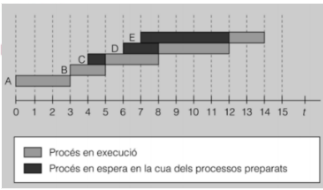
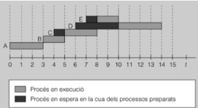
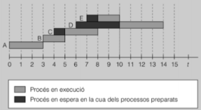

### Planificador 
El **planificador** és la part del sistema operatiu responsable de decidir quin procés s'executa en cada instant.

Quan tenim més d’un procés en marxa, el SO ha de planificar quin procés s’executa en cada moment.

### Temps importants en la planificació de processos
1. **Temps de resposta:** Quan triga el SO en donar-me servei.
2. **Temps de servei:** Temps que es triga en servir la petició, que inclou el temps d'espera i el temps d'execució en la CPU.
3. **Temps de processador:** És el temps de servei menys el temps d'espera a la cua.
4. **Temps d'espera:** El temps que un procés passa a la cua abans de ser servit.
5. **Eficiència:** Es calcula com el temps de processador dividit pel temps total.
6. **Rendiment:** Número de processos executats per unitat de temps.

### Algoritmes de Planificació
- **FIFO (First-In-First-Out):** El primer que entra, el primer que surt.

IMATGE FIFO: 

- **Round Robin:** Es reparteix el temps entre els processos que esperen, amb un temps màxim d'execució per a cada un.

IMATGE ROUND ROBIN:

- **SJF (Shortest Job First):** S'executen primer els processos més curts.

IMATGE SJF:

- **SRT (Shortest Remaining Time):** S'executen primer els processos amb el temps restant més curt.
- **Prioritats:** S'executen els processos amb la prioritat més alta.

IMATGE SRT:

Aquesta planificació és crucial per assegurar-se que els recursos del sistema s'utilitzen eficientment i que els processos s'executen de manera justa i ràpida.

[README](README.md)
